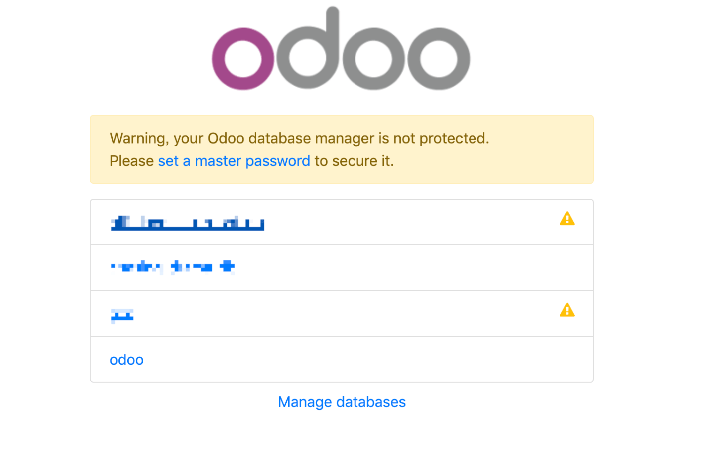

# 启动 Odoo

在我们拉取的源码的根目录下有一个 `odoo-bin` 的 Python 脚本文件，这个是 Odoo 的启动脚本。  

运行该脚本之后会在`8069`默认端口启动 Odoo 服务，启动之前需要运行 `pipenv shell` 进入虚拟环境。  

💡 如果是用 Pycharm 启动首先需要在 Preferences > Project > Project Interpreter > Add > Existing Environment 中
将使用 pipenv 生成的 Python 添加进去，一般 pipenv 生成的虚拟环境目录在 `~/.local/share/virtualenvs/`，如果是按照[上一篇](/Chapter-2/Use-Pipenv-Installing-Dependencies.md)生成的虚拟环境，
则目录则为 `~/.local/share/virtualenvs/odoo_env-*` (* 号为随机字符串)。

运行 Odoo 启动脚本：  

```shell
$ pipenv shell
$ ./odoo-bin
2019-01-08 14:23:16,295 118 INFO ? odoo: Odoo version 12.0
2019-01-08 14:23:16,296 118 INFO ? odoo: addons paths: ['/root/.local/share/Odoo/addons/12.0', '/root/odoo_dev/odoo/addons', '/root/odoo_dev/addons']
2019-01-08 14:23:16,296 118 INFO ? odoo: database: default@default:default
2019-01-08 14:23:16,380 118 INFO ? odoo.addons.base.models.ir_actions_report: You need Wkhtmltopdf to print a pdf version of the reports.
2019-01-08 14:23:16,477 118 INFO ? odoo.service.server: HTTP service (werkzeug) running on 074d4c08f8b7:8069
```

然后我们使用浏览器访问[http://localhost:8069](http://localhost:8069)，这时候可能会出现：  

```plain
odoo.sql_db: Connection to the database failed
...
psycopg2.OperationalError: FATAL:  role "xxx" does not exist - - -
```

出现这个错误的原因是我们还没有在 `Odoo 启动配置文件` 里配置数据库账号和密码，但是 Odoo 的启动配置文件在哪里呢。  

我们在命令行输入：  

```shell
$ ./odoo-bin --help
...
  Common options:
    -c CONFIG, --config=CONFIG
                        specify alternate config file
    -s, --save          save configuration to ~/.odoorc (or to
                        ~/.openerp_serverrc if it exists)
...
```
可以看到使用 `-s` 或 `--save` 参数，Odoo 会在 `home` 目录下生成 `.odoorc` 配置文件，并且用 `-c` 参数可以指定启动的配置文件。  

💡 若不指定 Odoo 的运行配置文件，并且 `home` 目录下存在 `.odoorc` 配置文件，则 Odoo 默认会选择这个作为启动的配置文件。  

于是我们可以先运行，然后在 `Ctrl + C` 停止 Odoo：  

```shell
$ ./odoo-bin -s
...
2019-01-08 14:37:57,127 152 INFO ? odoo.service.server: Hit CTRL-C again or send a second signal to force the shutdown.
```

然后编辑 ~/.odoorc 文件，将 `db_user` 和 `db_password` 分别修改为我们在[安装 PostgreSQL](/Chapter-2/Installing-PostgreSQL.md)时设置的用户 odoo 和这个用户的密码。  
  
```plain
...
db_password = ****
...
db_user = odoo
...
```

再次运行启动脚本启动 Odoo，这时已经可以成功访问 [http://localhost:8069](http://localhost:8069) 了，并且进入的是一个数据库选择页面，
我们可以直接选择 odoo 数据库或者点击 「Manage Databases」跳转到数据库创建页面。  



选择好数据库之后，就可以进入到 Odoo 的登陆界面了，默认的管理员账号密码均为 `admin`。  

为了在进入 Odoo 时防止每次都要显示数据库选择界面，我们将配置文件的 `db_name` 参数设置为我们的数据库名称，例如：`db_name=odoo`，或者在启动参数增加 `-d odoo`。  


💡 为了方便的修改 Odoo 的配置文件，可以复制 ~/.odoorc 到项目根目录下如 ./odoorc.ini，执行时增加 `-c ./odoorc.ini` 参数指定配置文件。

