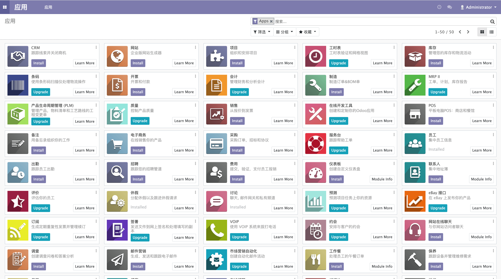
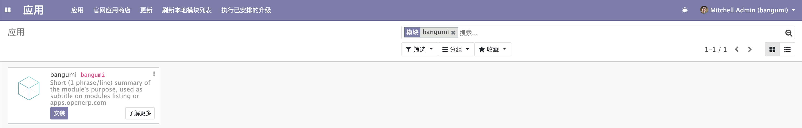
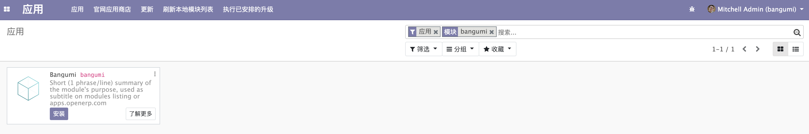

# 安装应用

打开 [http://localhost:8069](http://localhost:8069)，进入 Odoo 就可以看到 Apps 的页面。  

  

但是此时在右上角搜索 bangumi 并不能搜索到我们的 addon， 还需要配置一下 Odoo 的 addons 路径。  

打开 Odoo 配置文件 ~/.odoorc 并修改 addons_path，在参数的最后增加你的 Odoo-Book-Demo 的绝对路径，也就是 bangumi 的父路径，用逗号与前路径分隔开。  

若已将配置文件复制到 odoo-dev/ 也可以使用相对路径，接下来我们都会使用项目目录下的 `odoorc.ini` 配置文件，请读者将 ~/.odoorc 复制到 odoo-dev 目录下并重命名为 odoorc.ini。  

```shell
$ cat ./odoorc.ini
...
addons_path = ./addons,./Odoo-Book-Demo
...
```

就改完后运行 `./odoo-bin -c ./odoorc.ini` 重新启动 Odoo，此时我们还需要「刷新本地模块列表」，但是该菜单默认是隐藏的。  

我们需要点击所左上角，并点击「设置」到设置页面并点击「激活开发者模式」，再次回到应用页面后就可以看到「刷新本地模块列表」了。  

💡 除了点击「激活开发者模式」可以进入开发者模式外，我们可以通过在 URL 增加 `debug` 参数来进入开发者模式，
如 [http://localhost:8069/web?debug](http://localhost:8069/web?debug)。  

刷新本地模块列表后，我们再次搜索，发现依然没有搜索到 bangumi，原因是搜索框中的「应用」过滤把我们的应用给过滤掉了，点击「应用」的「x」将搜索过滤去掉后就可以看到我们的应用了。  

  

但搜索框中将 bangumi 标志为了模块，为了将 bangumi 修改为应用，需要修改 `__mainifest__.py` 文件。  

在 `__mainifest__.py` 文件中的字典增加 `application` 并设为 `True`。  

```python
{
    'name': "Bangumi",
    'application': True,
    # ...
}
```

重启 Odoo 并再次点击 「刷新本地模块列表」后，搜索后可以看到 bangumi 已经被修改为应用了。  

  

最后点击「安装」按钮就可以安装我们的应用了，但是安装后并不会有什么新的菜单或功能，所以接下来进入我们的开发章节。  
