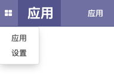
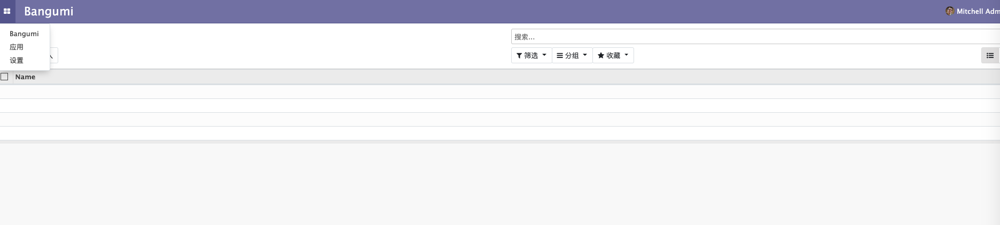
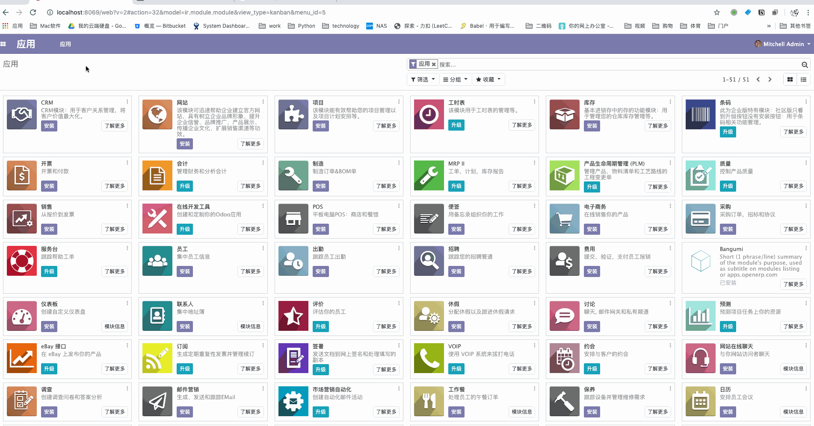

# 菜单创建

在我们的 bangumi 的 addon 目录下有个 views 文件夹，用于放置所有的菜单视图，列表和表单视图等视图的 XML 定义文件。  

接下来我们新建一个名为 `menus.xml` 的文件，并且写入以下代码。  

```xml
<odoo>
    <act_window
        id="act_bangumi_view"
        name="Bangumi"
        res_model="bangumi.bangumi"
        view_mode="tree,kanban,form"
    />

    <menuitem
        id="menu_bangumi_view"
        name="Bangumi"
        action="act_bangumi_view"
        groups="base.group_user"
    />
</odoo>
```

其中我们定义了两个元素：  

* `act_window` 元素定义了一个客户端窗口操作，它将打开 `bangumi.bangumi` 模型，并按顺序启用列表，看板和表单视图。  

* `menuitem` 定义了一个名 `Bangumi` 为主菜单，这个菜单会调用前面定义的 `act_bangumi_view` 动作，并且可以看到这个菜单的权限组为 `base.group_user` 即已登陆的内部用户。

定义完 `views/menus.xml` 文件，我们需要将它添加到 `__manifest__.py` 中，并升级 `bangumi` 模块使其生效。

```python
{
    #...
    # always loaded
    'data': [
        # 'security/ir.model.access.csv',
        'views/views.xml',
        'views/templates.xml',
        'views/menus.xml',
    ],
    #...
}
```

升级模块后发现，`Bangumi` 菜单并未出现在菜单列表中。这是什么原因导致的呢？  



这就牵扯到 Odoo 的权限控制，由于我们未给 `act_window` 关联的模型 `bangumi.bangumi` 设置权限，所以我们无法看到定义好的菜单。  

这一章节将不细讲 Odoo 的权限控制，我们现将以下内容复制到 `security/ir.model.access.csv` 文件内，这是一个 `csv` 文件，用于控制 Odoo 中定义的模型的权限，这段内容的意思是给我们定义的所有模型为 `base.group_user` 增加读、写等所有权限。  

```csv
id,name,model_id:id,group_id:id,perm_read,perm_write,perm_create,perm_unlink
access_bangumi_bangumi,bangumi.bangumi,model_bangumi_bangumi,base.group_user,1,1,1,1
access_bangumi_category,bangumi.category,model_bangumi_category,base.group_user,1,1,1,1
access_bangumi_tag,bangumi.tag,model_bangumi_tag,base.group_user,1,1,1,1
```

然后我们再次修改`__manifest__.py`:  

```python
{
    #...
    # always loaded
    'data': [
        'security/ir.model.access.csv',
        'views/views.xml',
        'views/templates.xml',
        'views/menus.xml',
    ],
    #...
}
```

再次打开 Odoo 页面就可以看到我们定义的菜单和模型对应的视图了。  



⚠️ 如果说在做完上述步骤后还不能看到菜单，可以尝试 `gif` 中的步骤，切换客户端语言。

1. 点击右上角用户信息
2. 切换语言后保存



导致这个问题的原因应该是前端缓存了客户端的菜单列表，若有读者通过别的更好的方式解决了这个问题，可以在 [issuse](https://github.com/TNK-Studio/Odoo-Book/issues) 中告诉我们。