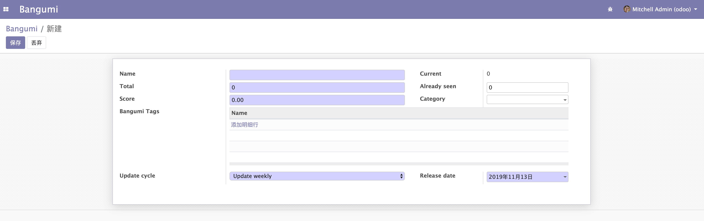
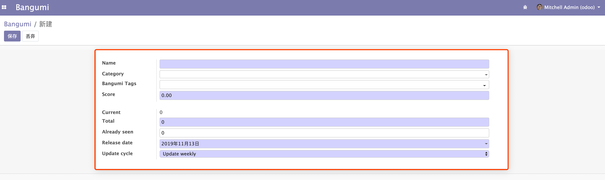
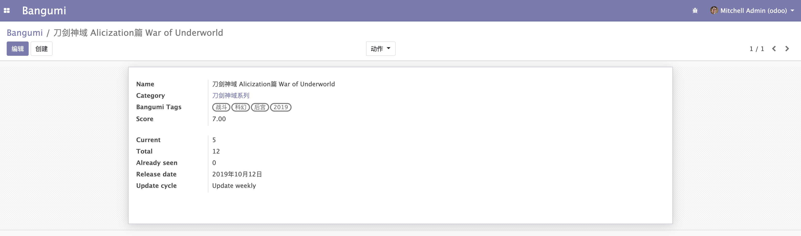

# 表单视图 Form View

上一节我们自定义了一个列表视图，那么我们可以创建一个数据试试效果了。  

那么可以点击左上角的「创建」按钮进入用于数据创建的 `Form View` （表单视图）。  



这个 Form 视图也是 odoo 默认生成的视图。在创建数据之前，我们也将这个视图定义一下吧。 

Form 视图定义的位置跟 Tree 视图定义的位置一样，这里就不讲整个文件贴出来了，只贴 Form 视图定义的部分。  

```xml
<record model="ir.ui.view" id="view_bangumi_bangumi_form">
    <field name="name">bangumi.form</field>
    <field name="model">bangumi.bangumi</field>
    <field name="arch" type="xml">
        <form>
            <sheet>
                <group>
                    <field name="name"/>
                    <field name="category_id"/>
                    <field name="tag_ids" widget="many2many_tags"/>
                    <field name="score"/>
                </group>
                <group>
                    <field name="current"/>
                    <field name="total"/>
                    <field name="already_seen"/>
                    <field name="release_date"/>
                    <field name="update_cycle"/>
                </group>
            </sheet>
        </form>
    </field>
</record>
```

与 Tree 视图不同的是 `<tree></tree>` 修改为了 `<form></form>`。其他部分大致相同，这里就介绍一下不同的地方。

第 6 行和第 20 行的 `<sheet></sheet>` 的作用是给表单提供一个「卡片」，效果如下图所示。你也可以尝试去掉这个标签对比一下有什么不同。

  

第 7 行和第 12 行、第 13 行和 第 19 行的 `<group></group>` 作用是给字段分组和提供前面的字段称显示。同样你可以尝试去掉这个标签对比一下有什么不同。  

创建并更新完成后，最终效果就跟上面的截图一样了。这里并没有将 form 关联到 `act_window`，因为创建后的` `form` 就成为了 `model` 的默认表单，所以可以直接生效，当然 `tree` 视图也是一样的，上一节为了演示可以显式指定 `view_id` 当然不指定也是可以生效的。  

当然 `form` 也可以显试指定，在 `act_window` 中的字段为 `view_ids`，它的指定方式比较特殊，需要使用波兰表达式，在官方的源码全局搜索 `view_ids` 可以查看示例，这里就不演示了。

接下来我们来尝试创建一条数据，这里我创建了一个 《刀剑神域 Alicization篇 War of Underworld》的数据，你们也可以自行创建自己喜欢的番剧，记得点击保存。  

创建过程中你肯定会发现，`Category` 和 `Bangumi Tags` 的创建表单也是默认生成的，当然你们也可以通过上面的方式去定义他们的 `form` 视图。  

最后数据创建的效果如下。  

   

我们可以发现原本没有填写的 `Current` 值自动生成了，这就是在 `model` 中定义的 `compute` 字段起的作用。  
