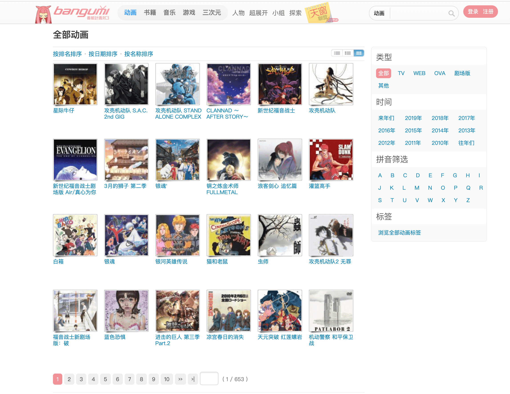
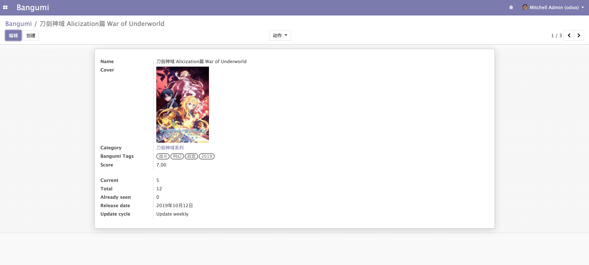
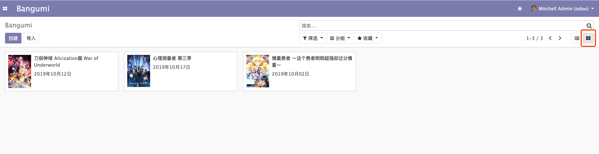

# 看板视图 Kanban View

很多时候我们会在一些站点上看到这样的页面。每个列表中的元素都以图片和文字的形式，以横向和竖向排列，这就是「看板」。

  

接下来我们会用 Odoo 中的 `Kanban View` 来实现这种效果。  

首先我们先给我们的模型增加封面图片字段吧，将字段定义到 `bangumi.bangumi` 模型中，字段定义如下。  

```python
cover_image = fields.Binary(string='Cover image', attachment=True)
```   

然后需要到 `views.xml` 给我们的 `Form` 视图增加一个字段用于显示和编辑封面字段。  

```xml
<field name="cover_image" widget="image"/>
```

更新后，并上传封面图片后的表单效果如下。  

  

接下来在 `views.xml` 中定义我们的 `Kanban View`。  `Kanban View` 的结构与其他的视图有一些不同，先放出 `Kanban View` 的完整定义。

```xml
<record model="ir.ui.view" id="view_bangumi_bangumi_kanban">
<field name="name">bangumi.kanban</field>
<field name="model">bangumi.bangumi</field>
<field name="arch" type="xml">
    <kanban>
        <field name="id"/>
        <field name="name"/>
        <field name="release_date"/>
        <templates>
            <t t-name="kanban-box">
                <div class="oe_kanban_global_click">
                    <div class="o_kanban_image">
                        
                    </div>
                    <div class="oe_kanban_content">
                        <div class="o_kanban_record_title">
                            <field name="name" class="o_text_overflow"/>
                        </div>
                        <div class="o_kanban_record_bottom">
                            <span class="oe_kanban_bottom_right">
                                <field name="release_date"/>
                            </span>
                        </div>
                    </div>
                </div>
            </t>
        </templates>
    </kanban>
</field>
</record>
```

1. 首先我们需要定义 `Kanban` 视图，这个跟前面的视图定义方式很类似。  

```xml
<record model="ir.ui.view" id="view_bangumi_bangumi_kanban">
<field name="name">bangumi.kanban</field>
<field name="model">bangumi.bangumi</field>
<field name="arch" type="xml">
    <kanban>
```

2. 需要列出你要使用的 `field` 字段，这个很重要！  

```xml
<field name="id"/>
<field name="name"/>
<field name="release_date"/>
```

3. 这一步与其他视图有些不同，需要定义一个 `<templates>`，这里先提前告诉你这是 Odoo 的一种模板语法叫做 `QWeb`。他与普通的 `HTML` 语法很类似，但是可以穿插逻辑语句交给后段执行并渲染，这里就不做详细介绍了，后面章节会详细介绍。  

这里要提一下 `QWeb` 中的 `img` 标签，他必须包含 `alt` 属性，否则会报错。它可以通过 `t-att-src` 属性设置需要渲染的图片。如果你需要渲染的图片来自具体的数据记录，你需要使用 `kanban_image` 函数。  

```xml

```

其中 `kanban_image` 有三个参数。第一个参数是具体的模型，这里为 `bangumi.bangumi`。第二个参数是图片所对应的字段，前面我们定义的字段是 `cover_image`。最后一个参数注意了是这个数据的 `id` 值，我们需要在第二部明确列出我们需要使用 `id` 字段才能在这里使用，否则会报错，这里要获取到 `id` 具体的值需要填写 `record.id.raw_value`。  

更新完成并刷新页面的，然后点击右上角的切换按钮，效果如下图所示。  

  
