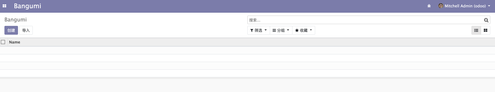
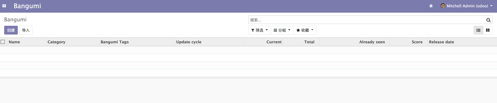

# 列表视图 List View

在上一章节中，我们已经为 bangumi 应用创建了入口菜单和菜单对应的动作。如果我们还未给动作对应的模型定义列表视图和表单视图，Odoo 会默认为我们生成列表视图。



默认视图只显示了 `Name` 字段，显然是不满足我们的需求的，接下来我们需要尝试给对应的模型自定义一个列表视图。

同样的进入 `bangumi` 模块下的 `views` 目录，并打开 `views.xml`。如果没有的话就新建一个 （这里的文件名不一定要使用 `views.xml` 也可以使用别的。）。  

```
views
        ├── menus.xml
        ├── templates.xml
        └── views.xml
```

打开之后我们需要在 `<odoo><data>{在这里定义}</data></odoo>` 中间定义一个 `tree` 视图也就是我们的 `List View`。

`tree` 视图的定义如下所示：
```xml
<odoo>
    <data>
        <record model="ir.ui.view" id="bangumi.bangumi_list_view">
            <field name="name">bangumi list</field>
            <field name="model">bangumi.bangumi</field>
            <field name="arch" type="xml">
                <tree>
                    <field name="name"/>
                    <field name="category_id"/>
                    <field name="tag_ids" widget="many2many_tags"/>
                    <field name="update_cycle"/>
                    <field name="current"/>
                    <field name="total"/>
                    <field name="already_seen"/>
                    <field name="score"/>
                    <field name="release_date"/>
                </tree>
            </field>
        </record>
    </data>
</odoo>
```

这里面的数据和结构我大致介绍一下：

第 3 行的 `model` 属性，定义了这是一个 `ir.ui.view` 也就是 odoo 的视图，`id` 属性指名了这个视图的唯一标示，所以在写的时候要注意它的命名和唯一性。如果不知道自己定义的视图 `id` 该怎么命名，可以参考官方的模块命名格式。

第 4 行的 `name` 是这个视图的名字，这个没有唯一约束。

第 5 行的 `model` 指明了这个视图关联的是哪个模型，这里关联的是 `bangumi.bangumi` 模型。

第 6 行是固定写法，第 7 行和第 17 行的 `<tree></tree>` 标签表明了这是一个列表视图。

第 8 行到第 16 行是这个视图需要展示的字段。其中 10 行的 `<field name="tag_ids" widget="many2many_tags"/>` 指明了这个字段使用一个叫 `many2many_tags` 的挂件（widget）来展示（odoo 中还有很多的 widget 这里就不一一介绍了，想了解的可以在官方源码中搜索 widget 关键字）。  

视图定义好之后，我们该如何使用呢。在使用之前我先介绍一下 odoo 的菜单、动作和视图的关系。  

在上一章节中，我们定义了 `menuitem` 和 `act_window`，他们分别代表了菜单和动作。从 `menuitem` 的定义中有 `action` 属性这个特点，我们不难看出菜单是入口，它可以关联动作。  

那么视图应该关联在哪里呢，有些同学可能觉得是菜单，但视图实际上是要关联动作。因为我们在点击菜单后触发动作，随后跳转到了一个默认的 `List View` 视图。在 `act_window` 有一个 `view_id` 的属性，用于显式指定关联的视图，当然默认是关联这个 `act_window` 的 `model` 模型所对应的默认视图。

接下来我们给 `act_window` 加上 `view_id` 来显式指定成我们刚刚定义的视图。  

```xml
<act_window
    id="act_bangumi_view"
    name="Bangumi"
    res_model="bangumi.bangumi"
    view_mode="tree,kanban,form"
    view_id="bangumi.bangumi_list_view"
/>
```

然后就可以升级我们的 `bangumi` 模块看看效果，当然升级之前别忘了检查 `__manifest__.py` 是否已经包含了我们定义的 `xml`。

升级完成后重新打开或刷新页面就可以看到效果了。


