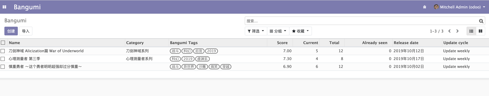
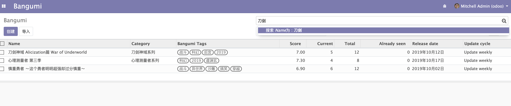
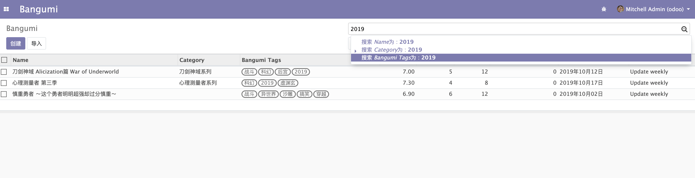

# 搜索视图 Search View

上一节我们介绍了如果自定义 `Form` 表单，并且创建了数据。这里我又创建多了两条数据，在 `Tree` 视图的效果如下。  



是不是已经有一点基本的样子了，让我们继续完善它。一个 Web 服务最重要的搜索功能不能少，当数据多的时候可以方便数据检索，接下来我们就完善它的搜索功能。  

odoo 虽然默认支持搜索，但是搜索功能很不友好，在输入提示这里也只有 `Name` 字段做了搜索提示。当然你也可以点击筛选做更高级的搜索，但是搜索这种重复使用的功能如果操作复杂就不好用了。

  

所以接下来我们要使用 `Search View` （搜索视图）来完善搜索功能。同样的我们需要在 `views.xml` 下定义该视图，以下是定义。  

```xml
<record model="ir.ui.view" id="bangumi.bangumi_search_view">
<field name="name">bangumi search</field>
<field name="model">bangumi.bangumi</field>
<field name="arch" type="xml">
    <search>
        <field name="name"/>
        <field name="category_id"/>
        <field name="tag_ids"/>
    </search>
</field>
</record>
```

`Search View` 与之前的定义不同的地方也是 `<search></search>`，然后需要在 `<search>` 标签中间添加你需要搜索提示的字段。Odoo 默认会使用这些字段的 `name` 字段作为搜索，当然一些情况下你可能不一定以外键字段的 `name` 字段作为搜索条件，这时候你就需要显式指定了。  

```xml
<record model="ir.ui.view" id="bangumi.bangumi_search_view">
<field name="name">bangumi search</field>
<field name="model">bangumi.bangumi</field>
<field name="arch" type="xml">
    <search>
        <field name="name"/>
        <field name="category_id" filter_domain="[('category_id.name', 'ilike', self)]"/>
        <field name="tag_ids" filter_domain="[('tag_ids.name', 'ilike', self)]"/>
    </search>
</field>
</record>
```

`filter_domain` 为你定义的搜索条件，可以参考这个章节 [过滤表达式 Domain](../Chapter-4/Domain.md)，其中 `self` 表示用户传入的搜索值，如用户搜索 `2019` 则 `self` 的值就为 `2019`。  

更新一下应用并刷新页面看一下效果。  

   
