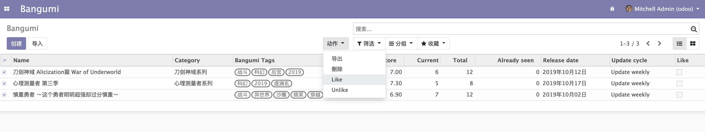

# 服务器动作  

接下来介绍`服务器动作`，这个也是开发过程中很常用的动作，它可以让 `odoo` 服务执行一段代码，并且它也可以绑定按钮或菜单，我们来动手实现一下。  

假设我们需要实现一个这样的功能，在 `bangumi` 模型增加一个 `like` 字段，然后我们就可以给我们添加的番剧点赞，但是有时候需要在列表页批量操作。  

我们先给对应的模型、tree 视图和 form 视图增加 `like` 字段。  

```python
like = fields.Boolean(string='Like', default=False)
```

然后在给 `bangumi.bangumi` 模型增加 `action_like` 和 `action_unlike` 两个函数。  

```python
class Bangumi(models.Model):
    _name = 'bangumi.bangumi'
    _description = 'Bangumi'

    @api.multi
    def action_like(self):
        return self.write({'like': True})

    @api.multi
    def action_unlike(self):
        return self.write({'like': False})

```

最后就是定义这个 `服务器动作`，在定义之前我们先看看这个服务器动作的模型定义，我们可以通过源码全文搜索 `_name = 'ir.actions.server` 找到这个模型。  

```python

class IrActionsServer(models.Model):
    # 省略代码 ...

    _name = 'ir.actions.server'
    _description = 'Server Actions'
    _table = 'ir_act_server'
    _inherit = 'ir.actions.actions'
    _sequence = 'ir_actions_id_seq'
    _order = 'sequence,name'

    # 省略代码 ...
    state = fields.Selection([
    ('code', 'Execute Python Code'),
    ('object_create', 'Create a new Record'),
    ('object_write', 'Update the Record'),
    ('multi', 'Execute several actions')], string='Action To Do',
    default='object_write', required=True,
    help="Type of server action. The following values are available:\n"
            "- 'Execute Python Code': a block of python code that will be executed\n"
            "- 'Create or Copy a new Record': create a new record with new values, or copy an existing record in your database\n"
            "- 'Write on a Record': update the values of a record\n"
            "- 'Execute several actions': define an action that triggers several other server actions\n"
            "- 'Add Followers': add followers to a record (available in Discuss)\n"
            "- 'Send Email': automatically send an email (available in email_template)")
    # 省略代码 ...
    model_id = fields.Many2one('ir.model', string='Model', required=True, ondelete='cascade',
                               help="Model on which the server action runs.")
    model_name = fields.Char(related='model_id.model', string='Model Name', readonly=True, store=True)
    # Python code
    code = fields.Text(string='Python Code', groups='base.group_system',
                       default=DEFAULT_PYTHON_CODE,
                       help="Write Python code that the action will execute. Some variables are "
                            "available for use; help about python expression is given in the help tab.")
    # 省略代码 ...
```  

当然你也可以从官方文档看到它的字段定义，[https://www.odoo.com/documentation/13.0/reference/actions.html#server-actions-ir-actions-server](https://www.odoo.com/documentation/13.0/reference/actions.html#server-actions-ir-actions-server)。  

可以从 `state` 字段看到 `action` 可以做如下几个事情：  

* code - Execute Python Code  
    执行一段 Python 代码  

* object_create - Create a new Record  
    创建一条数据  

* object_write - Update the Record  
    更新数据  

* multi - Execute several actions  
    执行一系列的动作  

如果我们要实现前面提到的功能，我们就需要用到 `code` 类型的服务器动作，来执行我们定义的 `like` 和 `unlike` 函数，于是我们就可以定义出这个服务器动作。  

```xml
<?xml version="1.0" encoding="UTF-8"?>
<odoo>
    <data>
        <record id="action_server_like_bangumi" model="ir.actions.server">
            <field name="name">Like</field>
            <field name="type">ir.actions.server</field>
            <field name="model_id" ref="model_bangumi_bangumi" />
            <field name="binding_model_id" ref="model_bangumi_bangumi" />
            <field name="state">code</field>
            <field name="code">records.action_like()</field>
        </record>

        <record id="action_server_unlike_bangumi" model="ir.actions.server">
            <field name="name">Unlike</field>
            <field name="type">ir.actions.server</field>
            <field name="model_id" ref="model_bangumi_bangumi" />
            <field name="binding_model_id" ref="model_bangumi_bangumi" />
            <field name="state">code</field>
            <field name="code">records.action_unlike()</field>
        </record>
    </data>
</odoo>
```  

那这个动作的入口在哪里呢？我们可以通过 `binding_model_id` 字段将它绑定到 tree 视图的 「动作」下来框。你肯定好奇，为什么这个字段没有在 `ir.actions.server` 模型中出现。  
因为 `binding_model_id` 字段存在于 `ir.actions.actions` 模型中，`ir.actions.server` 通过 `_inherit = 'ir.actions.actions'` 字段指定其将会继承 `ir.actions.actions` 模型，使其拥有 `ir.actions.actions` 的所有字段。  

Odoo 的继承树就不在这里介绍了，感兴趣的可以阅读一下官方文档，[https://www.odoo.com/documentation/13.0/reference/orm.html#inheritance-and-extension](https://www.odoo.com/documentation/13.0/reference/orm.html#inheritance-and-extension)。  

将这两个服务器动作定义完成后，更新模块你就可以在 `bangumi` 的 tree 视图中看到这个「动作」下拉框会新增 「Like」和 「Unlike」按钮。  

  

💡如果没看见 「动作」 下拉框，记得要选中几条记录。如果下拉框未出现「Like」和 「Unlike」按钮，可以尝试强制刷新浏览器或清除缓存。  
