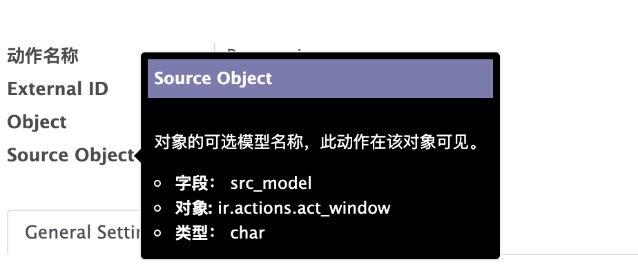

# 窗口动作

在第 5 章和第 6 章我们都使用到了一个 `act_window` 的标签定义在 `menus.xml` 中。  

```xml
<act_window
    id="act_bangumi_view"
    name="Bangumi"
    res_model="bangumi.bangumi"
    view_mode="tree,kanban,form"
    view_id="view_bangumi_bangumi_list"
/>
```

这就是一个`窗口动作`的定义。他还有另一种定义的写法。  

```xml
<record id="act_bangumi_view" model="ir.actions.act_window">
    <field name="name">Bangumi</field>
    <field name="res_model">bangumi.bangumi</field>
    <field name="view_mode">tree,kanban,form</field>
    <field name="view_id" ref="view_bangumi_bangumi_list"/>
</record>
```

是不是一下子就头大了，本来定义这个 `XML` 就不好记忆，为啥又多了一种写法。我该怎么记？  

在回答你的疑惑之前，我们先来了解一下 Odoo 定义的 `XML` 最终都去了哪里？  

其实在 `XML` 中定义的 `<record></record>` 标签指明了这是一条数据记录，最终他都会保存到数据库，而且这条记录也拥有 `Model`，也就是在 python 代码中也有跟我们在第 4 章定义的类一样的结构。那我们可以在哪里找到上面的 `record` 对应的 `Model` 呢？  

细心的同学肯定已经发现了，`record` 标签有一个 `model` 字段，已经告诉了你它对应的 `model` 是 `ir.actions.act_window`。  

接下来我们就可以利用这个关键字和全文检索在 Odoo 的源码中找到他。  

💡 可能很多人还不知道怎么做全文检索，这里简单说一下。如果你是用的是 `Pycharm`，可以点击 Odoo 源码文件夹的主目录，右键选择 `Find in Path` 或者使用快捷键 `ctrl + shift + F` （`command + shift + F`）进行全文检索。如果你是用的是 `Vscode` 可以使用快捷键 `ctrl + shift + F` （`command + shift + F`）进行全文检索。其他工具请在搜索引擎搜索使用方法。  

由于直接搜索 `ir.actions.act_window` 出现的关键字可能比较多，我们使用 `_name = 'ir.actions.act_window'` 关键字进行搜索。  

用这个关键字搜索后，你可能就直接找到了这个模型的定义，模型的部分定义如下。  

```python
class IrActionsActWindow(models.Model):
    _name = 'ir.actions.act_window'
    _description = 'Action Window'
    _table = 'ir_act_window'
    _inherit = 'ir.actions.actions'
    _sequence = 'ir_actions_id_seq'
    _order = 'name'

    # ...
```

我们可以从上面部分定义看到一个 `_table` 的属性，这个字段显式指定了这个模型对应数据库表是 `ir_act_window`。这里也提一下，如果这个字段没有显式指定的话，默认使用的表名是 `_name` 字段将 `.` 全部替换成 `_` 后的字符串，如 `bangumi.bangumi` 则对应的表名为 `bangumi_bangumi`。  

我们也可以从源码中看到这个模型定义的字段。  

```python
# 省略代码 ...
name = fields.Char(string='Action Name', translate=True)
# 省略代码 ...
view_id = fields.Many2one('ir.ui.view', string='View Ref.', ondelete='set null')
# 省略代码 ...
src_model = fields.Char(string='Source Model',
                            help="Optional model name of the objects on which this action should be visible")
# 省略代码 ...
view_mode = fields.Char(required=True, default='tree,form',
                            help="Comma-separated list of allowed view modes, such as 'form', 'tree', 'calendar', etc. (Default: tree,form)")
```

我们正好可以找到 `<record></record>` 标签中 `<field>` 对应的四个关键字 `name`、`res_model`、`view_mode` 和 `view_id`。  

```xml
<field name="name">Bangumi</field>
<field name="res_model">bangumi.bangumi</field>
<field name="view_mode">tree,kanban,form</field>
<field name="view_id" ref="view_bangumi_bangumi_list"/>
```

由此我们可以猜测 Odoo 将我们在 `XML` 中定义的 `record` 当成数据，按照对应的模型和数据库表，写入了数据库中。我们可以用以下 `SQL` 验证一下。  

```sql
psql -h 127.0.0.1 -U odoo
Password for user odoo:
psql (9.6.15)
Type "help" for help.

odoo=# select name, res_mode, view_mode, view_id FROM ir_act_window where name='Bangumi';

  name   |    res_model    |    view_mode     | view_id 
---------+-----------------+------------------+---------
 Bangumi | bangumi.bangumi | tree,kanban,form |     233
(1 row)
```

## 在 Odoo 中查看 "窗口动作" 的数据

除了用 `SQL`，`Odoo` 提供了另一种更加方便的方式查看这些数据。首先打开 `debug` 模式，不记得 `debug` 模式怎么打开可以查看第 3 章 ["安装应用" 章节](../Chapter-3/Instaing-Addon.md)。  

打开后点击左上角并选择「设置」，进入设置页面。然后在点击上方的「技术」菜单，选择「动作」下的「窗口动作」，就可以看到所有窗口动作的列表了。  

  

从列表我们就可以看到我们定义的 `Bangumi` 动作，如果没找见的话可以用右上角的搜索功能。接下来我们点击这行记录到 `Form` 视图看看。  

  

所以可以通过上述方式来查看自己定义的 `Action` 的属性。  

💡 可以通过将鼠标悬停在字段的名称上查看字段定义的详细信息。  

  
