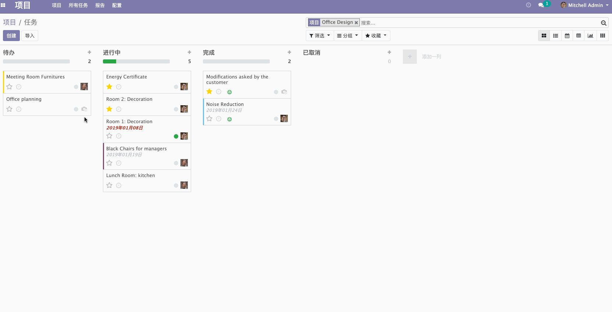
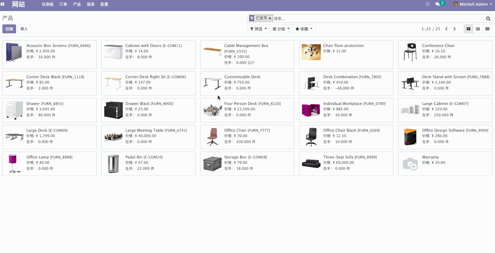
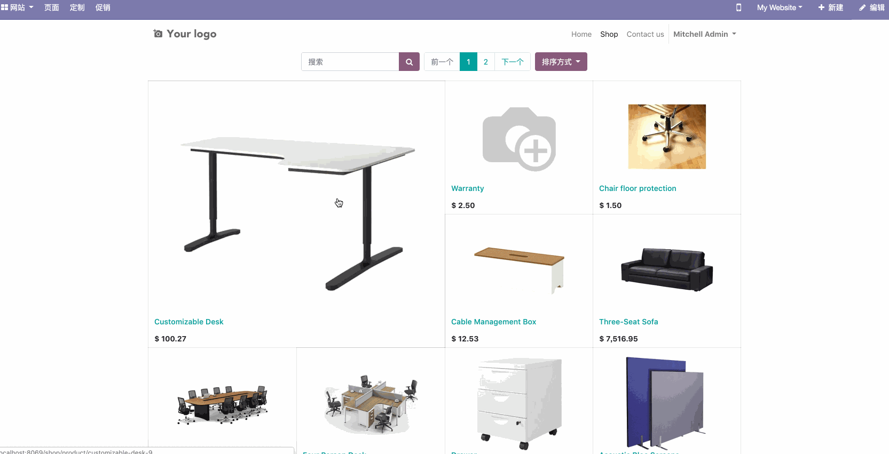

# Odoo 开发的应用简单演示

在 Odoo 的源码中有非常多开源的基于 Odoo 框架开发的企业应用。我们可以安装后直接使用，也可以用于学习 Odoo 框架。

  

所有的应用模块都是即插即用的方式，下面演示几个模块：

* Project 项目管理应用模块
  
    该非常类似大多数项目管理工具，拥有看板视图，拖拽的交互方式，这些都是可以在开发我们自己的应用模块中用到。
    
    

* Sale 销售应用模块
  
    该模块有产品管理，商品编辑等，拥有 Web 商城后台所必须的基本功能。  
    
    
    
    当然也有向消费者展示的商城页面。  
    
    

这些模块不仅可以给我们开发新的模块提供参考，并且 Odoo 的继承机制让我们可以基于这些应用模块进行扩展，使其更能满足我们的业务需求。希望读者们阅读完本书，也能基于 Odoo 开发自己的应用模块。